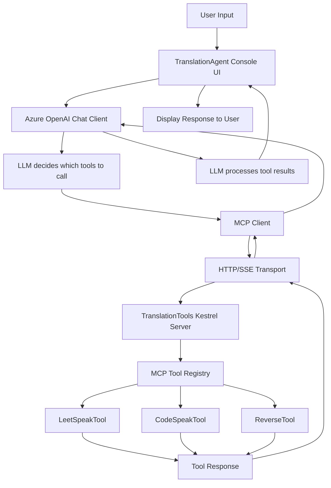

# Translation Agent with MCP Tools

A demonstration application that uses Model Context Protocol (MCP) to provide custom tools to an Azure OpenAI-powered chat agent.

## Project Structure

```
/
├── TranslationAgent/                    # Main chat client application
│   ├── Program.cs                       # Application entry point and DI setup
│   ├── ChatClientUI.cs                  # Console-based chat interface
│   ├── Extensions/
│   │   ├── IHostApplicationBuilderExtensions.cs  # Azure OpenAI client configuration
│   │   └── IServiceCollectionExtensions.cs       # MCP client registration
│   └── TranslationAgent.csproj          # Project file with dependencies
│
├── TranslationTools/                    # MCP server hosting custom tools
│   ├── Program.cs                       # Kestrel web server setup for MCP
│   ├── Tools/
│   │   ├── LeetSpeakTool.cs            # Converts text to leet speak (1337)
│   │   ├── CodeSpeakTool.cs            # Text transformation tool
│   │   └── ReverseTool.cs              # Reverses input text
│   └── TranslationTools.csproj         # Project file with MCP dependencies
│
├── prompt.md                          # Azure provisioning prompt for Copilot
└── TranslationAgent.sln               # Visual Studio solution file
```

### Key Components

- **TranslationAgent**: Console application that provides a chat interface using Azure OpenAI with access to custom MCP tools
- **TranslationTools**: ASP.NET Core web application that hosts MCP tools via Server-Sent Events (SSE) transport
- **Infrastructure**: Bicep templates and scripts for provisioning required Azure resources

## Architecture



## Azure Resource Provisioning

This project uses **GitHub Copilot for Azure** to provision the required Azure resources. The `prompt.md` file contains a structured prompt that Copilot can use to create an Azure OpenAI resource with the gpt-4o-mini model deployment.

> Create a new Azure Open AI resource in my Azure subscription, in a new resource group, and use random names for the resources and group. Then add a gpt-4o-mini model deployment to that resource instance. Once the resources have been provisioned, set the AZURE_OPENAI_ENDPOINT user secret to be the new Azure OpenAI instance's endpoint for the TranslationAgent project. My code optimizes for security and best practices when creating and managing Azure resources, so please don't use any secrets and connect to resources using managed identity.

### Using GitHub Copilot for Azure

1. Open the `prompt.md` file in this repository
2. Activate GitHub Copilot for Azure in Visual Studio 2022 (Preview feature)
3. Use the prompt to have Copilot provision:
   - New Azure Resource Group (random name)
   - Azure OpenAI resource (random name)
   - gpt-4o-mini model deployment
   - Set the `AZURE_OPENAI_ENDPOINT` user secret for the TranslationAgent project
4. Run the `TranslationTools` project using `dotnet run` or the Visual Studio or Visual Studio Code debuggers. The tools will need to be hosted and available prior to running the next step. 
5. Run the `TranslationAgent` project using `dotnet run` or the Visual Studio or Visual Studio Code debuggers. 
6. Provide a prompt to be translated.

The solution is designed with security best practices, using Azure Managed Identity for authentication rather than connection strings or API keys.

> **Learn more**: [GitHub Copilot for Azure Preview Launches in Visual Studio 2022 with Azure MCP Support](https://devblogs.microsoft.com/visualstudio/github-copilot-for-azure-preview-launches-in-visual-studio-2022-with-azure-mcp-support/)

## Getting Started

1. Use GitHub Copilot for Azure with the `prompt.md` file to provision Azure resources
2. Run the TranslationTools MCP server: `dotnet run --project TranslationTools`
3. Run the TranslationAgent client: `dotnet run --project TranslationAgent`
4. Start chatting and try prompts that would benefit from text transformation tools

The agent will automatically determine when to use the available tools based on your conversation context.
